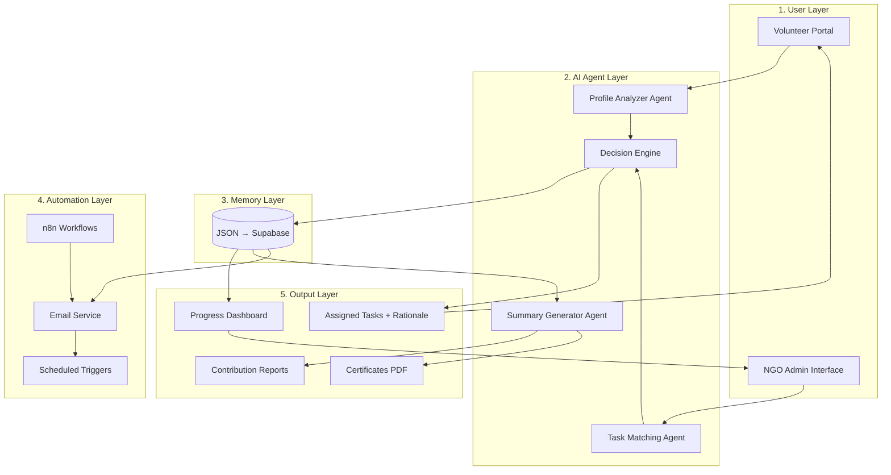
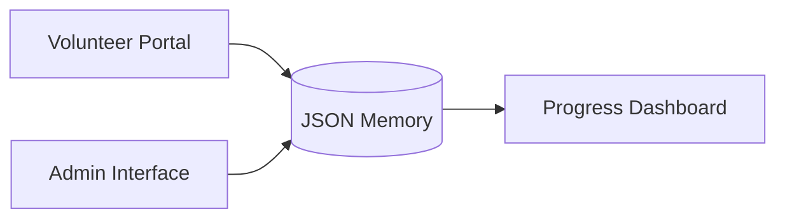
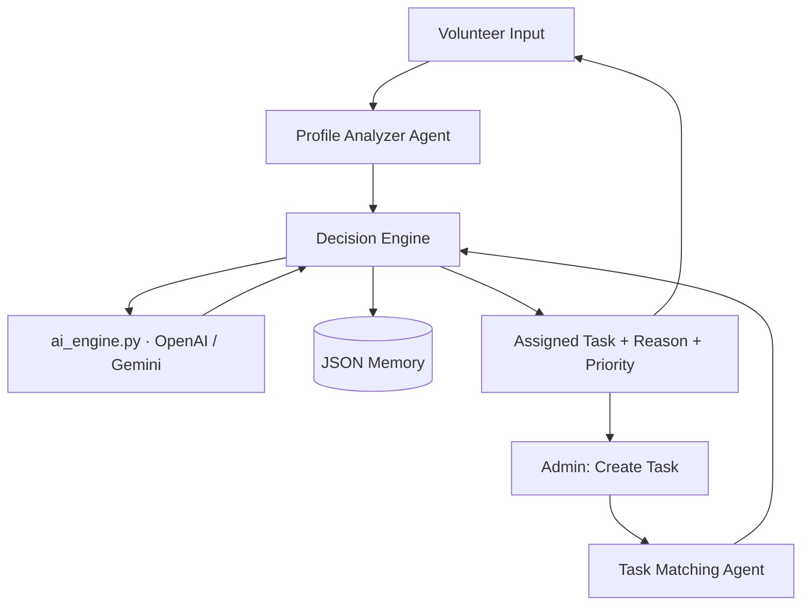
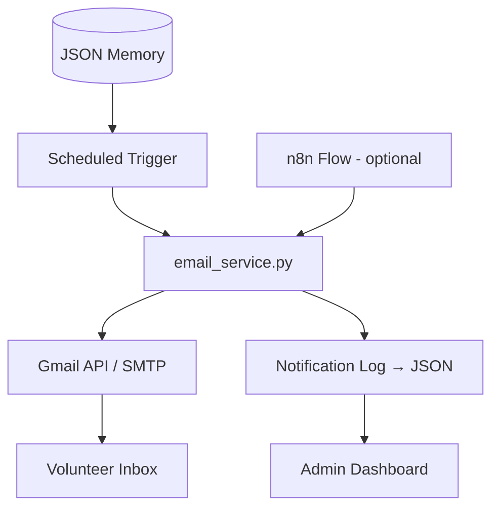
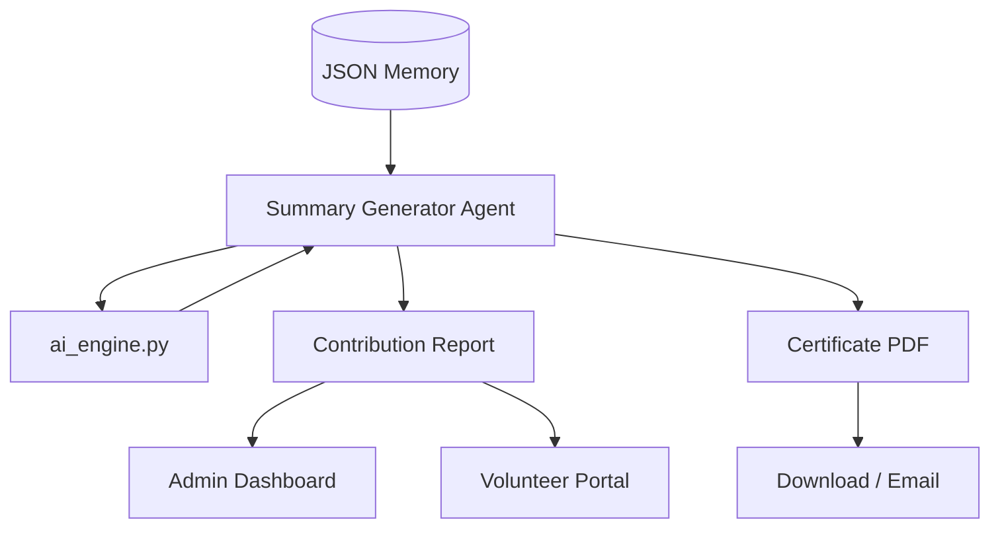
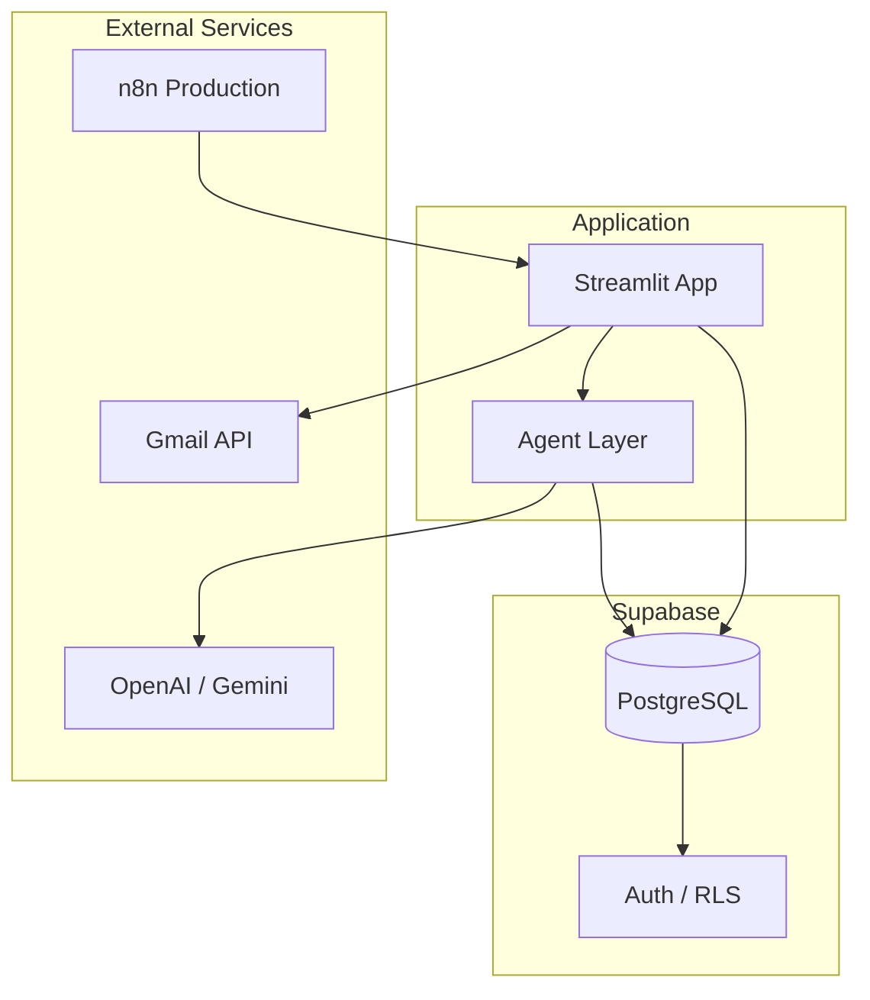
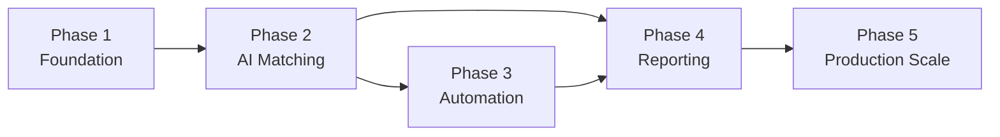

# NayePankh Bulbul — Phase-Wise Architecture

This document breaks the system described in [problemStatement.md](./problemStatement.md) into incremental delivery phases. Each phase activates specific layers, ships testable value, and sets up the next phase without rework.

---

## Roadmap at a Glance

| Phase | Name | Primary goal | Layers active |
|-------|------|--------------|---------------|
| **1** | Foundation | Register volunteers, manage tasks, persist data | User · Memory · Output (basic) |
| **2** | AI Matching | Intelligent volunteer–task assignment with rationale | + AI Agent |
| **3** | Automation | Deadline reminders and follow-ups | + Automation |
| **4** | Reporting | Contribution summaries and exportable outputs | + Summary Agent · Output (full) |
| **5** | Production Scale | Database, workflows, hardened deployment | All layers upgraded |

```
Phase 1          Phase 2              Phase 3           Phase 4              Phase 5
────────         ────────             ────────          ────────             ────────
User Layer   →   + AI Agents      →   + Automation  →   + Reports       →   Supabase
JSON Memory      Task Matching        Email/n8n         PDF/Certs           n8n prod
Admin Dashboard  LLM reasoning        Scheduled jobs    Summary Agent       Cloud deploy
Volunteer Portal Profile Analyzer                         Contribution dash
```

---

## End-State Architecture (All Phases Complete)



**Core data flow**

```
Volunteer Input → AI Agent Core → Task Matching → Memory Store → Dashboard → Automation → Summary
```

---

## Phase 1 — Foundation

**Goal:** Replace spreadsheets with a working app—volunteer registration, task management, and status tracking—backed by persistent JSON storage.

### Layers & components

| Layer | Status | Components |
|-------|--------|------------|
| User | ✅ Active | Streamlit Volunteer Portal (registration form); Admin Interface (create tasks, list volunteers) |
| AI Agent | ⏸ Deferred | — |
| Memory | ✅ Active | `volunteers.json`, `tasks.json`; CRUD helpers in `utils/helpers.py` |
| Automation | ⏸ Deferred | — |
| Output | ✅ Partial | Admin dashboard (volunteer list, task list, assignment status) |

### Architecture (Phase 1)



### Deliverables

- `app.py` — Streamlit entry with volunteer + admin views
- `data/volunteers.json` — profiles (name, skills, interests, availability)
- `data/tasks.json` — tasks (title, description, required skills, deadline, status)
- Manual task assignment (admin picks volunteer for a task)
- Assignment status: `pending` · `in_progress` · `completed`

### Tech

| Layer | Choice |
|-------|--------|
| Frontend | Streamlit |
| Backend | Python |
| Memory | JSON files |
| AI | None |
| Deploy | Local / Streamlit Cloud (optional) |

### Exit criteria

- [ ] Admin registers a volunteer with skills, interests, and availability
- [ ] Admin creates a task and assigns it manually
- [ ] Assignment status is visible on the dashboard without external spreadsheets

---

## Phase 2 — AI Matching

**Goal:** Automate volunteer–task matching using LLM reasoning; return 1–2 best-fit tasks with explanation and priority.

### Layers & components

| Layer | Status | Components |
|-------|--------|------------|
| User | ✅ Extended | “Get AI recommendations” action on admin and volunteer views |
| AI Agent | ✅ Active | Profile Analyzer · Task Matching Agent · Decision Engine |
| Memory | ✅ Extended | Store assignment rationale and AI match history |
| Automation | ⏸ Deferred | — |
| Output | ✅ Extended | Assigned tasks with reason and priority (High / Medium / Low) |

### Architecture (Phase 2)



### Agent responsibilities

| Agent | Input | Output |
|-------|-------|--------|
| **Profile Analyzer** | Raw registration fields | Structured profile (skills vector, interest tags, availability windows) |
| **Task Matching Agent** | Open tasks + volunteer pool | Ranked candidate list with fit scores |
| **Decision Engine** | Ranked list + rules (fairness, load balance) | Final 1–2 assignments with rationale and priority |

### Core prompt behavior

The Decision Engine enforces the **NayePankh Bulbul AI Volunteer Coordinator** contract:

- Recommend only **1–2 best-fit tasks** per volunteer
- Explain **why** each task was assigned
- Output: Assigned Task · Reason · Priority (High / Medium / Low)

### Deliverables

- `core/ai_engine.py` — LLM wrapper (OpenAI / Gemini)
- `core/prompts.py` — Profile, matching, and decision templates
- `agents/profile_analyzer.py`
- `agents/task_matcher.py`
- Admin flow: create task → receive AI-recommended volunteers with explanations
- Volunteer flow: view AI-assigned tasks with rationale

### Tech

| Layer | Choice |
|-------|--------|
| AI | OpenAI API or Gemini API |
| Memory | JSON (unchanged) |

### Exit criteria

- [ ] Admin creates a task and receives AI-recommended volunteer matches with explanations
- [ ] Volunteer sees assigned task(s) with reason and priority
- [ ] Match history persisted in JSON for audit

---

## Phase 3 — Automation

**Goal:** Proactive coordination—automated email reminders and follow-ups so admins no longer chase volunteers manually.

### Layers & components

| Layer | Status | Components |
|-------|--------|------------|
| User | ✅ Extended | Reminder preferences; “last notified” indicator on tasks |
| AI Agent | ✅ Unchanged | Phase 2 agents continue serving matching |
| Memory | ✅ Extended | Notification log (sent_at, type, recipient) |
| Automation | ✅ Active | Email service · scheduled triggers · optional n8n |
| Output | ✅ Extended | Reminder delivery status on dashboard |

### Architecture (Phase 3)



### Automation triggers

| Trigger | Action |
|---------|--------|
| Task deadline − 3 days | Reminder email to assigned volunteer |
| Task deadline − 1 day | Urgent follow-up |
| Task overdue | Escalation notice to admin |
| Task marked complete | Confirmation email to volunteer |

### Deliverables

- `utils/email_service.py` — templated emails via Gmail API or SMTP
- `workflows/n8n_flow.json` — optional webhook/cron integration
- Background scheduler (APScheduler or n8n cron)
- Admin view: notification history per task/volunteer

### Tech

| Layer | Choice |
|-------|--------|
| Automation | Gmail API or SMTP; optional n8n |
| Scheduler | APScheduler (in-app) or n8n cron |

### Exit criteria

- [ ] Volunteers receive automated reminders before deadlines
- [ ] Admin can see when reminders were sent
- [ ] Overdue tasks trigger escalation without manual intervention

---

## Phase 4 — Reporting & Output

**Goal:** Close the loop—generate contribution summaries, exportable reports, and optional certificates.

### Layers & components

| Layer | Status | Components |
|-------|--------|------------|
| User | ✅ Extended | Volunteer contribution view; admin report builder |
| AI Agent | ✅ Extended | Summary Generator Agent |
| Memory | ✅ Extended | Aggregated contribution metrics |
| Automation | ✅ Unchanged | Phase 3 reminders continue |
| Output | ✅ Full | Contribution reports · PDF certificates · export |

### Architecture (Phase 4)



### Output types

| Output | Audience | Content |
|--------|----------|---------|
| **Contribution report** | Admin | Tasks completed, hours/skills utilized, period summary |
| **Volunteer summary** | Volunteer | Personal impact narrative + task history |
| **Certificate (PDF)** | Volunteer | Completion certificate for program milestones |

### Deliverables

- `agents/summary_agent.py` — LLM-powered narrative + structured metrics
- Report generation by volunteer or date range
- PDF certificate template (e.g. ReportLab or WeasyPrint)
- Export: PDF / CSV for admin records

### Exit criteria

- [ ] Admin exports a contribution summary for a volunteer or time period
- [ ] Volunteer can view a personal contribution summary
- [ ] Certificate PDF generated for completed program milestones

---

## Phase 5 — Production Scale

**Goal:** Move from MVP to production-ready—real database, workflow automation, and reliable cloud deployment.

### Layers & components

| Layer | Upgrade |
|-------|---------|
| User | Role-based access; optional multi-page Streamlit or frontend migration |
| AI Agent | Prompt versioning; fallback provider (OpenAI ↔ Gemini) |
| Memory | **JSON → Supabase** (PostgreSQL): volunteers, tasks, assignments, notifications, reports |
| Automation | Production n8n instance; retry logic; rate limiting |
| Output | Cached reports; async PDF generation |
| Deploy | Streamlit Cloud / Render; env-based secrets |

### Architecture (Phase 5)



### Migration path (JSON → Supabase)

| JSON file | Supabase table | Notes |
|-----------|----------------|-------|
| `volunteers.json` | `volunteers` | Profile fields + structured skills JSONB |
| `tasks.json` | `tasks` | Task metadata + required skills |
| Assignment records | `assignments` | volunteer_id, task_id, status, rationale, priority |
| Notification log | `notifications` | sent_at, type, channel, status |
| Reports | `reports` | Generated summaries + PDF URLs |

### Deliverables

- Supabase schema + migration scripts
- Environment-based config (`.env` for API keys, DB URL)
- n8n production workflows wired to webhooks
- Deployment pipeline (Streamlit Cloud or Render)
- Row-level security for admin vs volunteer data

### Exit criteria

- [ ] All data persisted in Supabase with no JSON file dependency
- [ ] App deployed and accessible via stable URL
- [ ] Secrets managed via environment variables, not source code
- [ ] n8n (or equivalent) handles scheduled jobs in production

---

## Phase Dependency Map



Phases 3 and 4 both depend on Phase 2 (AI matching and memory must exist before reminders or summaries are meaningful). Phase 4 can start in parallel with Phase 3 once Phase 2 is stable.

---

## Layer Evolution by Phase

| Layer | Phase 1 | Phase 2 | Phase 3 | Phase 4 | Phase 5 |
|-------|---------|---------|---------|---------|---------|
| **User** | Registration + admin CRUD | + AI recommendation UI | + reminder status | + reports + certificates | + auth / RBAC |
| **AI Agent** | — | Profile · Match · Decision | — | + Summary Generator | Prompt versioning |
| **Memory** | JSON CRUD | + match history | + notification log | + report cache | Supabase |
| **Automation** | — | — | Email + scheduler | — | n8n production |
| **Output** | Basic dashboard | Tasks + rationale | Delivery status | Reports + PDF | Async + cached |

---

## Project Structure by Phase

Components introduced in each phase (cumulative):

```
naye-pankh-bulbul/
│
├── app.py                          # P1 — grows each phase
├── requirements.txt                # P1
├── README.md                       # P1
│
├── agents/
│   ├── profile_analyzer.py         # P2
│   ├── task_matcher.py             # P2
│   └── summary_agent.py            # P4
│
├── core/
│   ├── ai_engine.py                # P2
│   └── prompts.py                  # P2
│
├── data/
│   ├── volunteers.json             # P1 → migrated P5
│   └── tasks.json                  # P1 → migrated P5
│
├── utils/
│   ├── email_service.py            # P3
│   └── helpers.py                  # P1
│
└── workflows/
    └── n8n_flow.json               # P3 (optional) → P5 (production)
```

---

## Mapping to MVP Success Criteria

| Success criterion (from problem statement) | Phase |
|--------------------------------------------|-------|
| Register a volunteer with a structured profile | **1** |
| Create a task and receive AI-recommended matches with explanations | **2** |
| Track assignment status without manual spreadsheets | **1** (basic) · **2** (with AI history) |
| Trigger automated reminders for pending work | **3** |
| Export a basic contribution summary | **4** |

---

## Recommended Build Order

1. **Phase 1** — Validate data model and admin workflows with real NGO input
2. **Phase 2** — Highest-value differentiator; proves AI matching quality early
3. **Phase 3** — Reduces coordinator workload; depends on stable assignments from Phase 2
4. **Phase 4** — Demonstrates measurable volunteer impact for stakeholders
5. **Phase 5** — Harden for real deployment once feature set is validated
